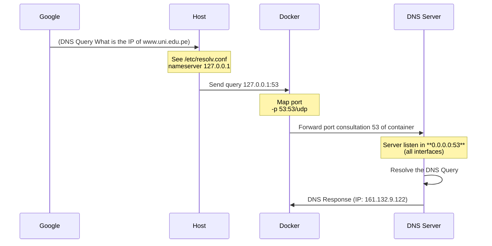

# DNS 

In this project we created a program that changes the operating system's default **systemd-resolved** to our DNS implementation.


It's just to modifying the file`/etc/resolv.conf` .

In modern Linux systems `/etc/resolv.conf` often points to 127.0.0.53, and this is a simbolic link 

```bash
ls -l /etc/resolv.conf
lrwxrwxrwx 1 root root 39 Feb 27 10:00 /etc/resolv.conf -> ../run/systemd/resolve/stub-resolv.conf

```

Here *l* in *lrwxrwxrwx* indicates a symbolic link.

How to configure our **DNS**.

1. Deactivate a systemd-resolved :
   ```bash	
   sudo systemctl stop systemd-resolved
   sudo systemctl disable systemd-resolved
   ```

2. To configure the `etc/resolve.conf` file, replace the symbolic link with a static file.

   ```bash
   sudo rm /etc/resolv.conf
   sudo nano /etc/resolv.conf
   ```

4. Configure the `etc/resolve.conf` 

   ```bash
   # This is /run/systemd/resolve/stub-resolv.conf managed by man:systemd-resolved(8).
   # Do not edit.
   # ..........
   
   #nameserver 127.0.0.53
   nameserver 127.0.0.1 #To send dns query to our dns server
   options edns0 trust-ad
   search .
   ```


5. Develop the application container.
   ```dockerfile
   ...
   #Stage 2, only need the binary file and OS since libcap2-bin for the root privileges 
   RUN apt-get update && apt-get install -y libcap2-bin
   #Get privileges because create a bind socket to listen in the port 53
   RUN setcap 'cap_net_bind_service=+ep' /dns
   EXPOSE 53/udp 53/tcp
   #Run the program :)
   CMD ["/dns"]
   ```

   

6. Sequential Diagram




7. Run the container 

   ```bash
   docker image build -t dns-server:v1 .
   docker container run --name dns-server -p 53:53/udp -p 53:53/tcp dns-server:v1 
   ```

   

8. Ok, of course you are without internet good bye. It's a joke, just change the DNS resolution handled on Linux system ```127.0.0.53```, enable and start.

   ```bash
   sudo nvim resolv.conf
   ```

   ```bash
   nameserver 127.0.0.53
   #nameserver 127.0.0.1
   options edns0
   search .
   ```

   ```bash
   sudo systemctl enable systemd-resolved.service
   sudo systemctl start systemd-resolved.service
   ```
