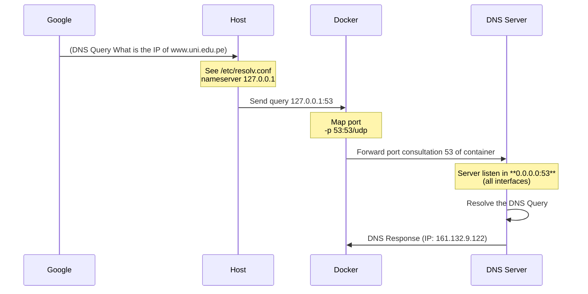

# DNS 

In this project, I run the **DNS server** in a Docker container, so I modify my OS (Linux) systemd-resolver for localhost loopback and send the DNS query to the container and resolves this.

## Configuration

Here I only explain how the configuration work, **I recommend just only reading and understanding, because in running I automate this and you will simple execute it with a few commands**.

In modern Linux systems `/etc/resolv.conf` often points to 127.0.0.53, and this is a symbolic link .

```bash
ls -l /etc/resolv.conf
lrwxrwxrwx 1 root root 39 Feb 27 10:00 /etc/resolv.conf -> ../run/systemd/resolve/stub-resolv.conf

```

Here *l* in *lrwxrwxrwx* indicates a symbolic link.

How to configure our **DNS**.

1. Deactivate a systemd-resolved :
   ```bash	
   sudo systemctl stop systemd-resolved
   sudo systemctl disable systemd-resolved
   ```

2. To configure the `etc/resolve.conf` file, replace the symbolic link with a static file.

   ```bash
   sudo rm /etc/resolv.conf
   sudo nano /etc/resolv.conf
   ```

4. Configure the `etc/resolve.conf` 

   ```bash
   # This is /run/systemd/resolve/stub-resolv.conf managed by man:systemd-resolved(8).
   # Do not edit.
   # ..........
   
   #nameserver 127.0.0.53
   nameserver 127.0.0.1 #To send dns query to our dns server(loopback)
   options edns0 trust-ad
   search .
   ```


5. Develop the application container.
   ```dockerfile
   #Dockerfile
   ...
   #Stage 2, only need the binary file and OS since libcap2-bin for the root privileges 
   RUN apt-get update && apt-get install -y libcap2-bin
   #Get privileges because create a bind socket to listen in the port 53
   RUN setcap 'cap_net_bind_service=+ep' /dns
   EXPOSE 53/udp 53/tcp
   #Run the program :)
   CMD ["/dns"]
   ```
   
   
   
6. Sequential Diagram




7. Run the container 

   ```bash
   docker image build -t dns-server:v1 .
   docker container run --name dns-server -p 53:53/udp -p 53:53/tcp dns-server:v1 
   ```


## Running

Install a python library for the banner `dns server`.

```bash
pip install pyfiglet
```

Run the file `your_program.py`

```bash
python3 your_program.py
```

**DNS server** is running, but the *docker-compose up* execution is blocking, so it is in another process(sub process),  so if you want to see its output. Open other terminal and type.

```bash
docker-compose logs -f dns-server
```

If you want to stop the server and enable ``systemd-resolved.service`` only press `Enter` in this terminal.

```bash
bardend@bardend:~/Documents/Cursos/8/Networks/c++/DockerDNS$ python3 your_program.py 

🛑 Stopping systemd-resolved...
🔧 Configuring /etc/resolv.conf...
✅ DNS configuration applied.

======================================================================
 ___  _  _ ___   ___ ___ _____   _____ ___ 
|   \| \| / __| / __| __| _ \ \ / / __| _ \
| |) | .` \__ \ \__ \ _||   /\ V /| _||   /
|___/|_|\_|___/ |___/___|_|_\ \_/ |___|_|_\
                                        
======================================================================

Press ENTER to stop the server and restart systemd-resolved.
```

Copyright (c) 2025  (UNI)

Author: Me
